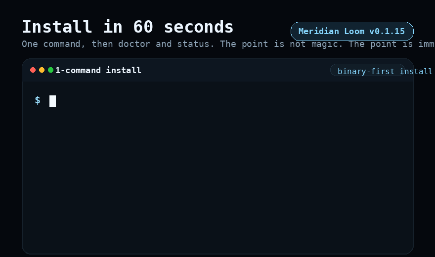

<p align="center">
  
</p>

<p align="center">
  
  
  
</p>

<p align="center">
  <strong>Install in one command. Run a governed local agent in minutes. Inspect the receipt instead of guessing.</strong>
</p>

<p align="center">
  
</p>

<p align="center">
  <a href="docs/INSTALL.md">Install</a> ·
  <a href="docs/QUICKSTART.md">Quickstart</a> ·
  <a href="docs/MIGRATE_FROM_CLAW.md">Migrate from Claw</a> ·
  <a href="docs/RUN_LOCAL.md">Run Local</a> ·
  <a href="docs/BENCHMARKS.md">Benchmarks</a> ·
  <a href="docs/RELEASE.md">Release</a> ·
  <a href="CONTRIBUTING.md">Contributing</a> ·
  <a href="docs/COMMUNITY_MAP.md">Community Map</a> ·
  <a href="docs/SERVICE.md">Service</a> ·
  <a href="docs/ARCHITECTURE.md">Architecture</a> ·
  <a href="docs/MERIDIAN_PoGE_PROTOCOL.md">PoGE</a>
</p>

# Meridian Loom – Governed Local Agent Runtime v0.1

Loom is the governed local runtime for AI agents. Install in one command, run
terminal/browser/schedule/personal-agent jobs, and inspect proof receipts
immediately. No vibes, just proof + governance.

If you want the shortest honest summary:

- **Install:** one command, binary first
- **Create:** `loom new-agent` provisions a governed personal agent with Kernel wiring
- **Operate:** one CLI for doctor, status, jobs, queue, parity, service, memory, and channels
- **Prove:** every governed execution and memory event emits receipts and proof views
- **Boundary:** the local runtime is real; broader hosted replacement is not claimed here

## 1-command install

```bash
curl -fsSL https://raw.githubusercontent.com/mapleleaflatte03/meridian-loom/main/scripts/install.sh | bash
```

The installer prefers prebuilt GitHub release assets for the current host and
falls back to a source build only when no matching asset is available.

## One-command first proof

```bash
loom quickstart \
  --root "$HOME/.local/share/meridian-loom/runtime/default" \
  --kernel-path /opt/meridian-kernel \
  --org-id "${MERIDIAN_ORG_ID:-local_foundry}" \
  --charter "First Proof Charter" \
  --agent-name "My First Agent" \
  --webhook-url "https://example.com/loom-hook" \
  --format human
```

`loom quickstart` is additive. It does not replace existing `loom init`,
`loom init-nation`, or `loom new-agent` flows.

Migration notes:

- If you already run scripted bootstrap, keep it unchanged.
- Adopt `loom quickstart` only when you want one command for first proof.

Rollback plan:

- Continue using `loom init` + `loom init-nation` + `loom new-agent` directly.
- Use `loom quickstart --non-interactive --format json` only for local onboarding automation.

## One-command migration profile

If you are moving from a Claw-family runtime and want a fast, additive Loom
bootstrap:

```bash
./scripts/bootstrap_from_claw_profile.sh \
  --profile openclaw \
  --root "$HOME/.local/share/meridian-loom/runtime/migrate-openclaw" \
  --kernel-path /opt/meridian-kernel \
  --org-id migration_openclaw
```

Supported profiles: `openclaw`, `openfang`, `zeroclaw`.
Current connect transport set includes `telegram`, `discord`, `whatsapp`,
`slack`, `email`, `browser`, `shell`, `webhook`, `grpc`, `a2a`, `mcp`,
`http`, and `ros2`.

Validation lane:

```bash
make acceptance-migration-profile-lane
```

## Developer first-proof flow

For contributors, one command runs the shortest end-to-end local developer flow:

```bash
make dev-first-proof
```

This validates first-proof UX before deeper feature work.

## Extension contract v1

`extension_contract_v1` adds an agnostic extension lifecycle with rollback
receipts:

```bash
cp ./templates/extensions/extension_contract_v1.sample.json ./extension.json
loom extension validate --manifest ./extension.json --root "$LOOM_ROOT" --format human
loom extension install --manifest ./extension.json --root "$LOOM_ROOT" --format human
loom extension export --extension-id my-extension --out ./exported-extension.json --root "$LOOM_ROOT" --format human
loom extension remove --extension-id my-extension --root "$LOOM_ROOT" --format human
```

Migration notes:

- Existing `loom connect` and capability flows remain unchanged.
- `loom extension` is additive and contract-scoped to `meridian.extension.contract.v1`.

Rollback plan:

- Every install/remove writes a rollback receipt in `artifacts/extensions/receipts/`.
- Use the receipt `rollback.command` to revert quickly from the same runtime root.

## Auth Contract v1

`auth_contract_v1` adds governed token alias lifecycle without persisting secret
values.

```bash
loom auth status --root "$LOOM_ROOT" --format human
loom auth rotate --alias manager_primary --env-var MERIDIAN_MANAGER_TOKEN_A --kernel-path "$MERIDIAN_KERNEL_PATH" --root "$LOOM_ROOT" --format human
loom auth revoke --alias manager_primary --kernel-path "$MERIDIAN_KERNEL_PATH" --root "$LOOM_ROOT" --format human
loom auth audit --root "$LOOM_ROOT" --limit 20 --format human
```

Migration notes:

- Existing provider profile auth env vars are migrated into alias records on `loom auth status`.
- This migration layer is additive and keeps current runtime profile behavior unchanged.

Rollback plan:

- Re-run `loom auth rotate` to restore a previous alias mapping.
- Use `loom auth audit` to recover the exact event order and alias transitions.

## Observability Contract v1

`observability_contract_v1` gives one operator decision surface across runtime
service, queue, proof chain, and route trace drift.

```bash
loom observe summary --root "$LOOM_ROOT" --fix-hints --format human
loom observe alerts --root "$LOOM_ROOT" --fix-hints --format human
loom observe watch --root "$LOOM_ROOT" --iterations 5 --interval-seconds 1 --format human
```

Migration notes:

- Existing `loom doctor`, `loom status`, and report commands remain unchanged.
- `loom observe` is additive and contract-scoped for operator diagnostics.

Rollback plan:

- Fall back to `loom doctor`, `loom status`, `loom parity report`, and `loom shadow report`.

## Create your first governed personal agent

```bash
export LOOM_ROOT="${HOME}/.local/share/meridian-loom/runtime/default"
export MERIDIAN_KERNEL_PATH=/opt/meridian-kernel
export MERIDIAN_ORG_ID="${MERIDIAN_ORG_ID:-local_foundry}"

loom new-agent \
  --name "My Assistant" \
  --root "$LOOM_ROOT" \
  --kernel-path "$MERIDIAN_KERNEL_PATH" \
  --org-id "$MERIDIAN_ORG_ID"

loom channel connect telegram \
  --agent my-assistant \
  --chat-id "123456789"

loom run-agent my-assistant
```

What that does:

- initializes Loom if needed
- registers the agent in Kernel with `runtime_binding=loom_native`
- creates `~/.config/meridian-loom/agents/my-assistant/`
- writes `agent.toml`, `README.md`, `MEMORY.md`, and `SOUL.md`
- lets you connect Telegram or webhook delivery later with `loom channel connect`
- starts a persistent heartbeat-driven governed loop when you run the agent

Inspect it:

```bash
loom run-agent status my-assistant
loom run-agent inspect my-assistant
loom run-agent diagnose my-assistant
loom run-agent watch my-assistant --once
loom status --root "$LOOM_ROOT"
loom memory receipts --root "$LOOM_ROOT" --limit 10
loom memory fork agent_my-assistant --branch warm-start --target-agent-id agent_my-assistant_lab --root "$LOOM_ROOT"
loom memory graph inspect <fork-root-or-id> --limit 5 --root "$LOOM_ROOT"
loom memory graph lineage <fork-root-or-id> --node-id <node-id> --direction both --root "$LOOM_ROOT"
loom memory replay <fork-root-or-id> --target-agent-id agent_my-assistant_lab --root "$LOOM_ROOT"
loom memory replay <fork-root-or-id> --target-agent-id agent_my-assistant_lab --node-id <node-id> --root "$LOOM_ROOT"
loom memory graph export <fork-root-or-id> --planner atlas --node-id <node-id> --objective "next research sprint plan" --root "$LOOM_ROOT"
loom channel health --root "$LOOM_ROOT" --agent my-assistant --history-limit 5 --diagnostic-limit 5
loom channel deliveries --root "$LOOM_ROOT" --include-archived
loom breed agent_atlas agent_quill --agent-id agent_atlas --mutation-rate 0.15 --root "$LOOM_ROOT" --kernel-path "$MERIDIAN_KERNEL_PATH"
loom init-nation --charter "Shadow Era Charter" --org-id "$MERIDIAN_ORG_ID" --root "$LOOM_ROOT" --kernel-path "$MERIDIAN_KERNEL_PATH"
loom connect scaffold --name telegram_ops_adapter --transport telegram --action-schema meridian.runtime.v1 --root "$LOOM_ROOT"
loom connect list --root "$LOOM_ROOT"
loom connect validate --adapter-id telegram-ops-adapter --root "$LOOM_ROOT"
loom connect enable --adapter-id telegram-ops-adapter --root "$LOOM_ROOT"
loom connect test --adapter-id telegram-ops-adapter --root "$LOOM_ROOT"
loom connect health --adapter-id telegram-ops-adapter --root "$LOOM_ROOT"
loom connect disable --adapter-id telegram-ops-adapter --root "$LOOM_ROOT"
loom extension install --manifest ./extension.json --root "$LOOM_ROOT"
loom extension export --extension-id my-extension --out ./my-extension-export.json --root "$LOOM_ROOT"
loom extension remove --extension-id my-extension --root "$LOOM_ROOT"
```

If the loop exits and the supervision policy says it should come back, reconcile it:

```bash
loom run-agent reconcile my-assistant
```

The full end-to-end flow lives in [docs/QUICKSTART.md](docs/QUICKSTART.md).

## What ships in the official v0.1 release

- One-command installer with binary-first release installs
- Prebuilt GitHub release assets for:
  - Linux x86_64
  - Linux arm64
  - macOS x86_64
  - macOS arm64
- Local runtime root under `$HOME/.local/share/meridian-loom`
- `loom` linked into `$HOME/.local/bin`
- Built-in governed capabilities for:
  - terminal execution
  - browser navigation
  - heartbeat scheduling
- Personal agent commands:
  - `loom new-agent`
  - `loom run-agent`
  - `loom run-agent inspect`
  - `loom run-agent reconcile`
  - `loom channel connect/list/health/test`
  - `loom memory receipts/fork/replay`
  - `loom deploy host/verify/rollback`
- Queue, job, audit, parity, and runtime-service surfaces on disk
- Memory receipts for write/read/remove/prune/fork/replay operations
- Proof of Governed Execution (PoGE) contract and receipt architecture

## Connect Runtime Contract v2 migration notes

- `loom connect` now normalizes registry state to `meridian.connect.registry.v2` with additive compatibility for v1 files.
- Existing adapter manifests remain valid; migration fills missing lifecycle/diagnostics fields and preserves transport/action schema.
- New operator lifecycle surface:
  - `loom connect validate`
  - `loom connect enable|disable`
  - `loom connect test --adapter-id ...`
  - `loom connect health --adapter-id ...`
  - `loom connect metrics --adapter-id ... [--retention-days <days>]`
  - `loom connect scorecard [--retention-days <days>] [--fix]`
  - `loom connect prune --adapter-id ... [--retention-days <days>]`
- Operator-priority transport templates:
  - `telegram`, `discord`, `browser`, `shell`, `webhook`
- Lifecycle state contract:
  - `init -> ready -> error -> reconnecting (max 3) -> fallback`
- Diagnostics/history persistence:
  - `state/connect/health/*.json`
  - `state/connect/tests/*.jsonl`
  - `state/connect/lifecycle/*.jsonl`
  - `artifacts/connect/latest.json`
  - default history retention: `30` days

Rollback plan:
- Keep a copy of `state/connect/registry.json` before migration.
- To roll back behavior, restore the backup registry and use only `loom connect scaffold|list`.
- Validate post-rollback state with `make acceptance-connect-lane`.

Operator acceptance scripts:
- `make acceptance-connect-ecosystem-lane`
- `make acceptance-branding-lane` (verifies M-wings/wordmark/lockup contract + desktop/mobile snapshots for `/`, `/demo`, `/compare`)

## Quickstart: three copy-paste examples

These examples are intentionally concrete. They assume:

- you installed `loom`
- your Kernel repo is available at `/opt/meridian-kernel`
- you are willing to keep the truth boundary explicit
- you are fine using `local_foundry` as the default local org id on a fresh root

If you have not initialized the Kernel yet, run the personal-agent flow above or example 3 first.

### 1. Run one terminal job and inspect the receipt

```bash
export LOOM_ROOT="${HOME}/.local/share/meridian-loom/runtime/default"
export MERIDIAN_KERNEL_PATH=/opt/meridian-kernel
export MERIDIAN_ORG_ID="${MERIDIAN_ORG_ID:-local_foundry}"

loom init \
  --root "$LOOM_ROOT" \
  --mode embedded \
  --kernel-path "$MERIDIAN_KERNEL_PATH" \
  --org-id "$MERIDIAN_ORG_ID"

loom doctor --root "$LOOM_ROOT" --format human

loom action execute \
  --root "$LOOM_ROOT" \
  --kernel-path "$MERIDIAN_KERNEL_PATH" \
  --agent-id agent_atlas \
  --org-id "$MERIDIAN_ORG_ID" \
  --capability loom.terminal.exec.v1 \
  --payload-json '{"argv":["bash","-lc","printf \"hello from loom\\n\""],"working_dir":".","timeout_ms":2000,"max_output_bytes":4096}' \
  --estimated-cost-usd 0.05

LATEST_JOB_ID="$(
  loom job list --root "$LOOM_ROOT" --format json \
    | python3 -c 'import json,sys; jobs=json.load(sys.stdin).get("jobs", []); print(jobs[0]["job_id"] if jobs else "")'
)"

loom job inspect --root "$LOOM_ROOT" --job-id "$LATEST_JOB_ID" --format human
loom parity report --root "$LOOM_ROOT"
loom shadow report --root "$LOOM_ROOT"
```

What you should see:

- a governed decision
- a runtime execution receipt
- audit/parity artifact paths
- one obvious next step if the run degraded

### 1b. Rehearse a warrant-bound shadow run and prepare zk settlement

Use this when you want the stricter `shadow -> proof -> settlement` path instead
of the general `action execute` path.

```bash
loom shadow run \
  --backend wasmtime \
  --root "$LOOM_ROOT" \
  --kernel-path "$MERIDIAN_KERNEL_PATH" \
  --agent-id agent_atlas \
  --org-id "$MERIDIAN_ORG_ID" \
  --action-type research \
  --resource system_info \
  --module builtin:system.info \
  --warrant-file ./shadow-warrant.json \
  --format human

loom job settle \
  --zk \
  --zk-backend sp1 \
  --root "$LOOM_ROOT" \
  --kernel-path "$MERIDIAN_KERNEL_PATH" \
  --actual-cost-usd 0.05 \
  --format human

loom parity report --root "$LOOM_ROOT"
loom shadow report --root "$LOOM_ROOT"
```

What this proves:

- the Wasmtime guest ran under a verified warrant
- PoGE produced a witness-bound Merkle receipt
- Court and Treasury were checked before settlement preparation
- parity and shadow reports can both see the new proof/settlement artifacts

### 1c. Rehearse semantic gRPC action transport with governed proof

This flow keeps the same semantic contract (`meridian.a2a.action.v1`) but
executes over a gRPC unary transport adapter (`grpcurl`).

```bash
loom shadow run \
  --backend grpc_action \
  --root "$LOOM_ROOT" \
  --kernel-path "$MERIDIAN_KERNEL_PATH" \
  --agent-id agent_atlas \
  --org-id "$MERIDIAN_ORG_ID" \
  --action-type shadow_grpc_action \
  --resource external_grpc_action \
  --warrant-file ./shadow-warrant.json \
  --url 127.0.0.1:50051 \
  --grpc-service meridian.runtime.v1.ActionService \
  --grpc-method SubmitAction \
  --grpc-action-kind research.deliver \
  --grpc-action-objective "deliver governed runtime diff" \
  --grpc-context-json '{"workflow":"trust_ops"}' \
  --grpc-constraints-json '{"max_latency_ms":12000}' \
  --grpc-memory-json '["mem://pattern/trust-ops-summary-v3"]' \
  --grpc-plaintext \
  --grpc-timeout-seconds 10 \
  --grpc-allow-unknown-fields \
  --format human

loom job settle \
  --zk \
  --zk-backend sp1 \
  --root "$LOOM_ROOT" \
  --kernel-path "$MERIDIAN_KERNEL_PATH" \
  --actual-cost-usd 0.05 \
  --format human
```

Notes:

- Requires a `grpcurl`-compatible binary in `PATH`, or set
  `LOOM_SHADOW_GRPCURL_BIN` to an explicit path.
- Optional flags: `--grpc-authority`, repeated `--grpc-import-path`,
  repeated `--grpc-proto`, repeated `--grpc-protoset`,
  `--grpc-timeout-seconds` (1..120),
  `--grpc-allow-unknown-fields`, and `--grpc-tls` override.
- RPC format is strict: `--grpc-service` and `--grpc-method` are combined into
  `<Service>/<Method>` and must not contain extra `/` segments.
- `shadow report` renders typed gRPC diagnostics (`grpc_target`, `grpc_rpc`,
  transport mode, timeout, proto/protoset counts) for the latest governed run.
- Typed diagnostics are persisted at
  `artifacts/shadow/grpc_action/latest.json` (+ `stream.jsonl`) under your
  runtime root.
- Both `shadow report` and `parity report` surface the typed gRPC diagnostics
  block from that artifact.
- Use `loom shadow grpc-diagnostics --root "$LOOM_ROOT" --limit 20` for a
  stream/history operator view.
- Proof and settlement artifacts are generated the same way as other shadow
  backends.
- `job settle --zk` accepts `--zk-backend` (currently `sp1`).

### 1d. Rehearse embodied gRPC physical action transport

This flow keeps warrant/governance/PoGE semantics and switches transport +
schema to embodied physical actions (`meridian.embodied.action.v1`).

```bash
loom shadow run \
  --backend grpc_physical \
  --root "$LOOM_ROOT" \
  --kernel-path "$MERIDIAN_KERNEL_PATH" \
  --agent-id agent_atlas \
  --org-id "$MERIDIAN_ORG_ID" \
  --action-type shadow_grpc_physical \
  --resource external_grpc_physical \
  --warrant-file ./shadow-warrant.json \
  --url 127.0.0.1:50051 \
  --grpc-service meridian.embodied.action.v1.PhysicalActionService \
  --grpc-method Execute \
  --grpc-action-kind physical.move \
  --grpc-action-objective "move robot to staging point" \
  --physical-robot-id unitree.go2 \
  --physical-target warehouse.aisle-7 \
  --physical-command move_to_pose \
  --physical-safety-class restricted \
  --physical-dry-run \
  --grpc-physical-lifecycle stream \
  --grpc-physical-ack-required \
  --grpc-physical-ack-timeout-seconds 5 \
  --grpc-physical-cancel-on-ack-timeout \
  --grpc-plaintext \
  --grpc-timeout-seconds 10 \
  --format human
```

Embodied notes:

- `grpc_physical` requires:
  `--physical-robot-id`, `--physical-target`, `--physical-command`,
  `--physical-safety-class`.
- Request schema is strict and validated as
  `meridian.embodied.action.v1` before transport execution.
- Typed embodied diagnostics are persisted under
  `artifacts/shadow/grpc_action/latest.json` (+ `stream.jsonl`) and include:
  `grpc_physical_robot_id`, `grpc_physical_target`,
  `grpc_physical_command`, `grpc_physical_safety_class`,
  `grpc_physical_dry_run`.
- Stream lifecycle controls are available for richer embodied contracts:
  `--grpc-physical-lifecycle unary|stream`,
  `--grpc-physical-ack-required`,
  `--grpc-physical-ack-timeout-seconds`,
  `--grpc-physical-cancel-on-ack-timeout`,
  `--grpc-physical-cancel-after-seconds`.
- Typed diagnostics now persist lifecycle fields:
  `grpc_lifecycle_mode`, `grpc_lifecycle_ack_required`,
  `grpc_lifecycle_ack_received`, `grpc_lifecycle_cancelled`,
  `grpc_lifecycle_cancel_reason`.
- `shadow report` and `parity report` both render these physical fields from
  typed artifacts.

### 1d.5. Rehearse embodied A2A physical action transport

Use this when you want embodied semantic governance with an A2A HTTP transport
contract (`meridian.a2a.physical.v1`).

```bash
loom shadow run \
  --backend a2a_physical \
  --root "$LOOM_ROOT" \
  --kernel-path "$MERIDIAN_KERNEL_PATH" \
  --agent-id agent_atlas \
  --org-id "$MERIDIAN_ORG_ID" \
  --action-type shadow_a2a_physical \
  --resource external_a2a_physical \
  --warrant-file ./shadow-warrant.json \
  --url http://127.0.0.1:8088/shadow-a2a-physical \
  --header "x-shadow-test: enabled" \
  --a2a-physical-method message/send \
  --a2a-physical-request-id shadow-a2a-physical-test \
  --a2a-physical-kind physical.move \
  --a2a-physical-objective "dispatch embodied workflow" \
  --a2a-physical-skill atlas_motion \
  --physical-robot-id unitree.go2 \
  --physical-target warehouse.aisle-7 \
  --physical-command move_to_pose \
  --physical-safety-class restricted \
  --physical-dry-run \
  --grpc-context-json '{}' \
  --grpc-constraints-json '{}' \
  --grpc-memory-json '[]' \
  --format human
```

### 1e. Rehearse embodied ROS2 physical action transport

This flow keeps the same semantic embodied request (`meridian.embodied.action.v1`)
and executes through a ROS2 service bridge (`ros2 service call`).

```bash
loom shadow run \
  --backend ros2_physical \
  --root "$LOOM_ROOT" \
  --kernel-path "$MERIDIAN_KERNEL_PATH" \
  --agent-id agent_atlas \
  --org-id "$MERIDIAN_ORG_ID" \
  --action-type shadow_ros2_physical \
  --resource external_ros2_physical \
  --warrant-file ./shadow-warrant.json \
  --ros2-service /meridian/physical_action/execute \
  --ros2-type meridian_embodied_msgs/srv/ExecutePhysicalAction \
  --ros2-timeout-seconds 20 \
  --ros2-physical-kind physical.move \
  --ros2-physical-objective "move robot to staging point" \
  --physical-robot-id unitree.go2 \
  --physical-target warehouse.aisle-7 \
  --physical-command move_to_pose \
  --physical-safety-class restricted \
  --physical-dry-run \
  --format human
```

ROS2 notes:

- Requires a `ros2` CLI binary in `PATH`, or set `LOOM_SHADOW_ROS2_BIN`.
- Supports two execution modes:
  - `--ros2-mode service` (default) with `--ros2-service` + `--ros2-type`.
  - `--ros2-mode action` with `--ros2-action-name` + `--ros2-action-type`
    and optional `--ros2-action-feedback`,
    `--ros2-action-cancel-after-seconds`.
- Operator diagnostics persist transport metadata (`transport_kind=ros2`,
  `ros2_mode`, service/action endpoint+type, timeout) together with embodied
  action fields.

ROS2 action mode example:

```bash
loom shadow run \
  --backend ros2_physical \
  --root "$LOOM_ROOT" \
  --kernel-path "$MERIDIAN_KERNEL_PATH" \
  --agent-id agent_atlas \
  --org-id "$MERIDIAN_ORG_ID" \
  --action-type shadow_ros2_physical \
  --resource external_ros2_physical \
  --warrant-file ./shadow-warrant.json \
  --ros2-mode action \
  --ros2-action-name /meridian/physical_action/goal \
  --ros2-action-type meridian_embodied_msgs/action/ExecutePhysicalAction \
  --ros2-action-feedback \
  --ros2-action-cancel-after-seconds 5 \
  --ros2-timeout-seconds 20 \
  --ros2-physical-kind physical.move \
  --ros2-physical-objective "move robot to staging point" \
  --physical-robot-id unitree.go2 \
  --physical-target warehouse.aisle-7 \
  --physical-command move_to_pose \
  --physical-safety-class restricted \
  --physical-dry-run \
  --format human
```
- One-command acceptance script for `shadow run -> job settle --zk -> reports`:

```bash
./scripts/acceptance_shadow_zk.sh
# or
make acceptance-shadow-zk

# full flow (core path + typed report assertions)
./scripts/acceptance_shadow_zk_lane.sh
# or
make acceptance-shadow-zk-lane

# embodied core flow (ros2_physical -> settle --zk -> reports)
./scripts/acceptance_shadow_embodied_zk.sh
# or
make acceptance-shadow-zk-embodied

# memory graph flow (inspect + selective replay governance gates)
./scripts/acceptance_memory_graph_lane.sh
# or
make acceptance-memory-graph-lane

# nation bootstrap flow
./scripts/acceptance_init_nation_lane.sh
# or
make acceptance-init-nation-lane

# breed flow (DNA artifact + governance gates)
./scripts/acceptance_breed_lane.sh
# or
make acceptance-breed-lane

# extension flow (validate/install/remove/export + rollback receipt)
./scripts/acceptance_extension_lane.sh
# or
make acceptance-extension-lane

# first-proof quickstart flow
./scripts/acceptance_quickstart_lane.sh
# or
make acceptance-quickstart-lane

# deploy flow (host/verify/rollback idempotency)
./scripts/acceptance_deploy_lane.sh
# or
make acceptance-deploy-lane

# auth flow (status/rotate/revoke/audit governance)
./scripts/acceptance_security_auth_lane.sh
# or
make acceptance-security-auth-lane

# observability flow (summary/alerts/watch)
./scripts/acceptance_observability_lane.sh
# or
make acceptance-observability-lane

# OSS DX flow (developer onboarding surface)
./scripts/acceptance_oss_dx_lane.sh
# or
make acceptance-oss-dx-lane
```

Core shadow+zk merge gate:

```bash
./scripts/acceptance_shadow_zk_lane.sh
cargo test -p loom-shadow
cargo test -p meridian-loom --test shadow_zk
```

Additional domain-specific acceptance scripts can be run independently before merge.

### 2. Run bounded browser navigation and inspect proof

```bash
export LOOM_ROOT="${HOME}/.local/share/meridian-loom/runtime/default"
export MERIDIAN_KERNEL_PATH=/opt/meridian-kernel
export MERIDIAN_ORG_ID="${MERIDIAN_ORG_ID:-local_foundry}"

loom action execute \
  --root "$LOOM_ROOT" \
  --kernel-path "$MERIDIAN_KERNEL_PATH" \
  --agent-id agent_atlas \
  --org-id "$MERIDIAN_ORG_ID" \
  --capability loom.browser.navigate.v1 \
  --payload-json '{"session_id":"docs-example","url":"https://example.com","allowed_hosts":["example.com"],"wait_for":"dom_content_loaded","timeout_ms":4000,"capture_semantic_snapshot":true}' \
  --estimated-cost-usd 0.05

LATEST_JOB_ID="$(
  loom job list --root "$LOOM_ROOT" --format json \
    | python3 -c 'import json,sys; jobs=json.load(sys.stdin).get("jobs", []); print(jobs[0]["job_id"] if jobs else "")'
)"

loom job inspect --root "$LOOM_ROOT" --job-id "$LATEST_JOB_ID" --format human
loom parity report --root "$LOOM_ROOT"
```

This proves the local browser host-call flow and its receipt surfaces. It does
not claim broad hosted browser automation.

### 3. Connect Loom to Kernel using `quickstart.py`

```bash
cd /opt/meridian-kernel
python3 quickstart.py --init-only

export LOOM_ROOT="${HOME}/.local/share/meridian-loom/runtime/default"
export MERIDIAN_ORG_ID="${MERIDIAN_ORG_ID:-local_foundry}"
loom init \
  --root "$LOOM_ROOT" \
  --mode embedded \
  --kernel-path /opt/meridian-kernel \
  --org-id "$MERIDIAN_ORG_ID"

loom contract show --root "$LOOM_ROOT" --kernel-path /opt/meridian-kernel
loom doctor --root "$LOOM_ROOT" --format human
```

If you want the Kernel demo dashboard as well:

```bash
cd /opt/meridian-kernel
python3 quickstart.py --port 8080
```

That gives you the governed workspace while Loom remains the local execution
surface.

## Doctor and status should tell you what to do next

The first-run commands worth memorizing are:

```bash
loom doctor --root "$HOME/.local/share/meridian-loom/runtime/default" --format human
loom status --root "$HOME/.local/share/meridian-loom/runtime/default"
```

The goal of both commands is simple:

- `doctor` tells you whether the runtime is ready, degraded, or blocked
- `status` tells you where the runtime, queue, service, and agent artifacts live
- `run-agent inspect` gives one operator view for supervisor state, channel health, recent deliveries, and recent memory receipts
- `run-agent diagnose` turns crash/channel state into concrete next commands instead of leaving you to infer remediation from raw status
- `run-agent watch` gives a compact terminal dashboard over the same operator surface
- `channel health` now includes recent health transitions and test diagnostics, not just the current point-in-time state
- both should point to an obvious next command instead of forcing you to read the source

## Benchmark harness

Loom now ships a tiny reproducible benchmark harness at
[`scripts/bench_runtime.py`](scripts/bench_runtime.py). It measures short-lived
CLI cold starts and approximate peak RSS on the same host.

Example:

```bash
python3 scripts/bench_runtime.py \
  --iterations 5 \
  --warmup 1 \
  --case "loom status::./target/release/loom status --root /tmp/loom-bench-root" \
  --case "openfang help::openfang --help" \
  --case "ironclaw::ironclaw --help" \
  --format markdown
```

Current reference run on the Meridian VPS (`2026-04-01`):

| Case | Mean cold start (ms) | p95 (ms) | Peak RSS (MiB) |
| --- | ---: | ---: | ---: |
| `loom status` | 29.8 | 33.9 | 4.8 |
| `openfang --help` | 28.5 | 30.8 | 2.8 |
| `ironclaw --help` | 32.6 | 33.9 | 5.1 |

Why this exists:

- OpenFang is strong on one-binary operator packaging
- IronClaw is strong on secure local-assistant ergonomics
- Loom should make the comparison reproducible on one machine, with one script,
  and with a clear boundary around what the numbers do and do not mean

See [docs/BENCHMARKS.md](docs/BENCHMARKS.md) for the benchmark boundary and the
recommended command choices.

## Release story

Loom releases are GitHub-first operator packages. Tagging `v0.1.16` builds and
publishes release archives for:

- Linux x86_64
- Linux arm64
- macOS x86_64
- macOS arm64

Each asset includes the Loom binary, example config, docs, installer helpers,
systemd units, and a checksum file.

See [docs/RELEASE.md](docs/RELEASE.md) for the release layout.

## Meridian stack

- [meridian-loom](https://github.com/mapleleaflatte03/meridian-loom): official first-party governed local runtime
- [meridian-kernel](https://github.com/mapleleaflatte03/meridian-kernel): runtime-neutral governance, policy, authority, treasury, and court
- [meridian-intelligence](https://github.com/mapleleaflatte03/meridian-intelligence): first-party workflows and public product surfaces built on Loom + Kernel

## Proof of Governed Execution (PoGE)

The cryptographic execution-receipt architecture is defined in the
[Meridian PoGE Protocol RFC](docs/MERIDIAN_PoGE_PROTOCOL.md).

- Purpose: bind governed host-calls to verifiable receipts, Merkle roots, and future settlement surfaces
- Scope: Loom runtime host-call evidence and audit architecture
- Boundary: this repo does not claim that every future settlement primitive is already live here

## Truth boundary

- Local install, queue, audit, parity, and runtime-service surfaces are real
- Terminal execution, browser navigation, and heartbeat scheduling are real local primitives
- Hosted runtime replacement is not claimed here
- Multi-channel presence and memory should only be claimed through named proof surfaces, not vague runtime language
- Compatibility and migration surfaces exist where they still help real operator cutovers; they do not turn Loom into a broad hosted-runtime claim

## Operational surface

- `loom init`, `loom doctor`, `loom health`, `loom status`
- `loom start`, `loom stop`, `loom restart`, `loom logs`
- `loom auth status|rotate|revoke|audit`
- `loom observe summary|alerts|watch`
- `loom queue inspect|consume|ack|run-once|run-until-empty|status`
- `loom job list|inspect`
- `loom parity report`
- `loom shadow report`
- `loom capability list|show|gap show|scaffold|forge|import-workspace-skill|verify|promote|shim`
- `loom service start|status|submit|import-commitments|stop`

## Rehearsals

- Operational rehearsals live in `scripts/tests/`
- Migration and backward-compatibility rehearsals live in `scripts/migration_tools/`
- Generated `examples/*-output.txt` transcripts are not checked in
