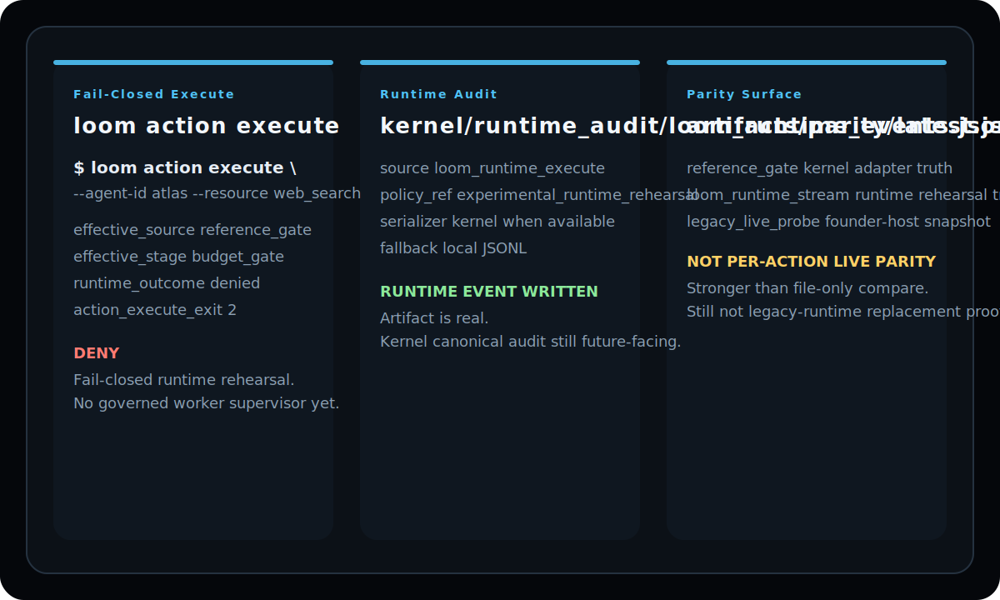

<p align="center">
  
</p>

<p align="center">
  Rehearsal transcripts for the public scaffold: install path, operator path, fail-closed path, and current parity path.
</p>

<p align="center">
  
  
  
</p>

<p align="center">
  <a href="../README.md">Loom README</a> ·
  <a href="PUBLICATION_CHECKLIST.md">Publication Checklist</a> ·
  <a href="ARCHITECTURE.md">100 Improvements</a> ·
  <a href="https://github.com/mapleleaflatte03/meridian-kernel/blob/main/docs/LOOM_SPEC.md">Loom Spec</a> ·
  <a href="https://app.welliam.codes">Live Host</a>
</p>

# Meridian Loom // Setup Rehearsal

This repository includes nine focused rehearsals plus the broader setup sweep:

- a founder-host rehearsal against the current kernel truth
- a fixture-backed rehearsal for local sanction denial
- a fixture-backed allow-path rehearsal
- a fixture-backed queue supervisor rehearsal
- a fixture-backed bounded supervisor watch rehearsal
- a fixture-backed bounded supervisor daemon rehearsal
- a fixture-backed local runtime service rehearsal
- a fixture-backed local HTTP runtime control-plane rehearsal
- a fixture-backed sender-side commitment import rehearsal

The point is not to pretend Loom is already a runtime. The point is to make the
install path, operator path, and fail-closed runtime rehearsal concrete enough
to inspect honestly.

<p align="center">
  
</p>

## Rehearsal matrix

| Script | What it proves | What it does not prove |
|---|---|---|
| `./scripts/bootstrap_embedded.sh` | local bootstrap, build, doctor, health | runtime replacement |
| `./scripts/tests/rehearse_first_governed_cell.sh` | governed identity, queue, supervisor, audit, parity | hosted scheduler |
| `./scripts/tests/rehearse_local_sanction_preview.sh` | deny path when local sanctions override reference allow | real hosted enforcement |
| `./scripts/tests/rehearse_allow_execute.sh` | allow path, budget reservation commit, runtime event receipt, action parity comparison | hosted replacement |
| `./scripts/tests/rehearse_supervisor_queue.sh` | queue-backed supervisor and job ledger | long-running hosted daemon |
| `./scripts/tests/rehearse_supervisor_watch.sh` | bounded watch-loop state and heartbeat history | daemonized service |
| `./scripts/tests/rehearse_supervisor_daemon.sh` | local daemon lifecycle shell | hosted runtime supervisor |
| `./scripts/tests/rehearse_runtime_service.sh` | local runtime service lifecycle, ingress stream, service-owned execution shell | hosted ingress service |
| `./scripts/tests/rehearse_runtime_http_service.sh` | tokenized local HTTP control plane for runtime service status/submit/stop | hosted HTTP runtime ingress |
| `./scripts/migration_tools/rehearse_commitment_import.sh` | sender-side commitment outbox import into Loom queue | live cross-host replacement |

## Current rehearsal scope

The rehearsal verifies:

1. The Rust workspace builds.
2. The Rust workspace tests pass.
3. `loom init` creates config and local state.
4. `loom doctor` reports configuration and filesystem health.
5. `loom health` returns a structured summary in the canonical operator grammar.
6. `loom config show` renders the resolved local boundary and worker paths.
7. `loom contract show` can read the current kernel runtime registry.
8. `loom agent resolve` resolves a governed agent identity against the kernel registry.
9. `loom envelope build` constructs a normalized action envelope.
10. `loom capsule inspect` surfaces the local capsule state boundary.
11. `loom shadow preflight` captures experimental shadow events for all seven
    contract surfaces.
12. `loom shadow decide` writes a standalone decision artifact for the current
    effective allow/deny result.
13. `loom shadow enforce` reuses that same decision surface and exits fail-closed
    (`0` allow, `2` deny).
14. `loom action execute` now materializes a runtime execution receipt instead
    of stopping at a shell preflight gate.
15. `audit_emission` now writes a runtime-side audit artifact through the
    kernel-owned `audit.py log-runtime` path into
    `kernel/runtime_audit/loom_runtime_events.jsonl` when a kernel is present,
    with a local fallback only when no kernel audit path exists.
16. `loom shadow compare` still exists for offline diffing of event logs.
17. `loom parity report` is now the stronger surface: it reads the runtime-side
    parity stream and the latest parity report produced by `loom action execute`.
18. When available on the founder host, the parity stream also captures a real
    OpenClaw proof snapshot via `openclaw_runtime_proof.py --json`.
19. The decision surface still unions a local sanction preview derived from the
    resolved identity snapshot with the read-only reference gate result.
20. A fixture-backed rehearsal proves that `execute` / `remediation_only`
    restrictions deny locally even when the reference gate would otherwise allow.
21. `loom supervisor watch` now drives the queue supervisor through a bounded
    polling loop, writes `state/runtime/supervisor/status.json`, and appends
    heartbeat history into `state/runtime/supervisor/heartbeat.jsonl`.
22. `loom supervisor daemon start/status/stop` now wrap that same queue
    supervisor in a real local lifecycle shell with `runtime_state.json`,
    background logging, and stop-request handling.
23. `loom wasm run` now executes a local Wasmtime guest under the configured
    store limits and pooling profile, so the Wasm resource lane is runnable
    instead of documentation-only.
24. `loom service start/status/submit/stop` now expose a local runtime-service
    shell with service state, service events, ingress receipts, and truthful
    transport reporting.
25. When the local Unix socket boundary is unavailable, the runtime service
    falls back to file-backed ingress under `run/ingress/` instead of
    failing silently.
26. `loom service start --http-address ... --service-token ...` can now expose
    a tokenized local HTTP control plane with `GET /status`, `POST /submit`,
    and `POST /stop` when the host allows binding.
27. `loom service import-commitments` can now import sender-side
    `execution_request` delivery refs from a commitments snapshot into the
    local Loom queue, creating import markers under
    `state/runtime/imports/commitment_execution/`.

## What the rehearsal does not prove

- It does not prove runtime-level contract compliance.
- It does not upgrade registry compliance beyond 0/7.
- It does not prove transport adapters exist.
- It does not prove OpenClaw replacement.
- It does not prove hosted per-action OpenClaw parity.
- It does not prove a hosted daemon supervisor or long-running scheduler.
- It does not prove a hosted long-running scheduler or worker pool.
- It does not prove a hosted runtime service or durable ingress transport.
- It does not prove live commitment-outbox cutover from an independent host.
- The live OpenClaw probe is a runtime health/proof snapshot, not a replayed
  gate-by-gate execution stream.
- The hosted kernel's global audit trail is still not owned by Loom.

## Run

```bash
./scripts/tests/rehearse_setup.sh
```

The script creates a disposable directory under `/tmp/loom-rehearsal` by
default, auto-discovers a governed agent from the current kernel registry, and
does not mutate the Meridian kernel.

## Fresh public clone verification

After the first public push, the scaffold was re-verified from a clean clone of
`https://github.com/mapleleaflatte03/meridian-loom.git` on the founder host.

The verification path was:

```bash
git clone https://github.com/mapleleaflatte03/meridian-loom.git /tmp/meridian-loom-clone/repo
cd /tmp/meridian-loom-clone/repo
cargo test
cargo build
./scripts/tests/rehearse_setup.sh
```

That fresh-clone run passed and confirmed:

1. The public repository builds from scratch.
2. The public repository tests pass from scratch.
3. The bundled rehearsal still succeeds against the current kernel truth.
4. The scaffold still reports `planned` runtime status and `0/7` proven hooks.

The current founder-host rehearsal now exercises both the old and new surfaces:

- `loom shadow compare` still compares reference-adapter event logs against
  Loom's shadow log for offline inspection
- `loom action execute` writes a runtime execution receipt, a runtime-side
  audit artifact, and a parity stream
- `loom parity report` surfaces that parity stream plus a live OpenClaw proof
  snapshot when the founder-host proof script is available, and now gives a
  guided next-step message when no parity artifacts exist yet

That is still not a claim of per-action runtime parity. It is a stronger,
runtime-side rehearsal surface than the previous file-only diff.

The rehearsal also emits `artifacts/shadow/decision.json`, which records the
current gate outcome using the same reference stage and reason that drove the
preflight result. That decision artifact is still experimental and adapter-
backed; it does not make Loom a governed execution runtime.

There is now a separate allow-path rehearsal:

```bash
./scripts/tests/rehearse_allow_execute.sh
```

That script proves the current local supervisor path:
- the effective decision is `allow`
- `loom action execute` dispatches the default Python worker
- the worker writes a result artifact under `state/runtime/jobs/<input_hash>/`
- runtime audit emission uses the kernel-owned `audit.py log-runtime` path and
  lands in `kernel/runtime_audit/loom_runtime_events.jsonl`
- parity artifacts include a per-action OpenClaw probe stream entry, even when
  the probe is unavailable in the synthetic fixture

There is now a separate queue-backed supervisor rehearsal:

```bash
./scripts/tests/rehearse_supervisor_queue.sh
```

That script proves the current queue supervisor path:
- `loom action enqueue` materializes a pending queue artifact under
  `state/runtime/queue/pending/<policy_class>/`
- `loom job list` surfaces that queued action through the runtime-owned job
  ledger before the supervisor runs
- `loom supervisor run` processes the queued action through the same effective
  decision surface used by `loom action execute`
- the processed queue entry moves to `state/runtime/queue/processed/`
- `loom job inspect --job-id <input_hash>` then surfaces the persisted job
  snapshot with queue, decision, execution, parity, and audit artifact paths
- the runtime audit lands in `kernel/runtime_audit/loom_runtime_events.jsonl`
- parity and shadow reports stay consistent with the supervisor-processed action

There is now a separate bounded supervisor watch rehearsal:

```bash
./scripts/tests/rehearse_supervisor_watch.sh
```

That script proves the current watch-loop surface:
- `loom supervisor watch` repeatedly invokes the same queue supervisor boundary
  for a fixed number of iterations
- `loom supervisor status` reads that stored loop state back as an operator surface
- the loop writes `state/runtime/supervisor/status.json`
- the loop appends per-iteration state into
  `state/runtime/supervisor/heartbeat.jsonl`
- queue counts, allow/deny counts, and processed counts stay inspectable across
  iterations
- the result is still a bounded local rehearsal loop, not a hosted or daemonized
  scheduler

The rehearsal script lives at `scripts/tests/rehearse_supervisor_watch.sh`.

There is now a separate bounded supervisor daemon rehearsal:

```bash
./scripts/tests/rehearse_supervisor_daemon.sh
```

That script proves the current daemon-lifecycle surface:
- `loom supervisor daemon start` spawns a background child for the local queue
  supervisor rehearsal
- `loom supervisor daemon status` reads `runtime_state.json` and surfaces
  session, PID, heartbeat count, and queue totals
- `loom supervisor daemon stop` records a local stop request that the daemon
  loop honors cleanly
- the daemon appends to `state/runtime/supervisor/heartbeat.jsonl` and writes
  `state/runtime/supervisor/runtime_state.json`
- the result is still a bounded local daemon rehearsal, not a hosted runtime
  supervisor

The rehearsal script lives at `scripts/tests/rehearse_supervisor_daemon.sh`.

There is now a separate local runtime service rehearsal:

```bash
./scripts/tests/rehearse_runtime_service.sh
```

That script proves the current local service shell:
- `loom service start` writes `run/service/runtime_state.json`
  and background log state
- `loom service submit` can deliver a governed action through the service
  boundary and wait for a receipt
- the service prefers a Unix socket transport but truthfully falls back to
  file-backed ingress when the socket boundary is unavailable on the host
- `loom service status` reads the persisted service lifecycle state back as an
  operator surface
- `loom service stop` records a local stop request and the loop exits cleanly

The rehearsal script lives at `scripts/tests/rehearse_runtime_service.sh`.

There is now a separate local HTTP control-plane rehearsal:

```bash
./scripts/tests/rehearse_runtime_http_service.sh
```

That script proves the current tokenized HTTP surface:
- `loom service start --http-address 127.0.0.1:0 --service-token ...` binds a
  local HTTP control plane when the host permits it
- unauthenticated `GET /status` is rejected when a service token is configured
- authenticated `POST /submit` lands the same queue, job, audit, and parity
  artifacts as the socket/file ingress path
- authenticated `POST /stop` requests a clean local shutdown through that same
  boundary

The rehearsal script lives at `scripts/tests/rehearse_runtime_http_service.sh`.

There is now a separate commitment import rehearsal:

```bash
./scripts/migration_tools/rehearse_commitment_import.sh
```

That script proves the current sender-side import seam:
- a commitments snapshot can carry `delivery_refs` for
  `execution_request` envelopes
- `loom service import-commitments` can materialize those sender-side
  `delivery_refs` into the Loom queue
- the import writes marker files under
  `state/runtime/imports/commitment_execution/`
- the queued result is then inspectable through `loom job list` and
  `loom job inspect`

The rehearsal script lives at `scripts/migration_tools/rehearse_commitment_import.sh`.

The rehearsal now also proves both fail-closed surfaces against the current
kernel truth:

- `loom shadow enforce` returns exit code `2`
- `loom action execute` also returns exit code `2`

On the founder host, both deny because the reference budget gate denies the
action.

## Fixture-backed local sanction preview verification

The founder-host rehearsal proves the real current kernel path. A second,
fixture-backed rehearsal exists to prove the local sanction override path:

```bash
./scripts/tests/rehearse_local_sanction_preview.sh
```

That script creates a synthetic kernel fixture where:

1. The resolved agent identity includes an `execute` restriction.
2. The read-only reference adapter still returns `allow`.
3. `loom shadow decide` reports `effective_source: local_sanction_preview`.
4. `loom shadow enforce` returns exit code `2`.
5. `loom action execute` also returns exit code `2` and writes a runtime
   execution receipt plus parity artifacts.

This is intentionally a fixture-backed proof surface, not a claim about the
founder host's current kernel state. The fixture rehearsal explicitly disables
the founder-host OpenClaw probe so the transcript stays synthetic. Its
transcript lives at
`examples/local-sanction-preview.txt`.
